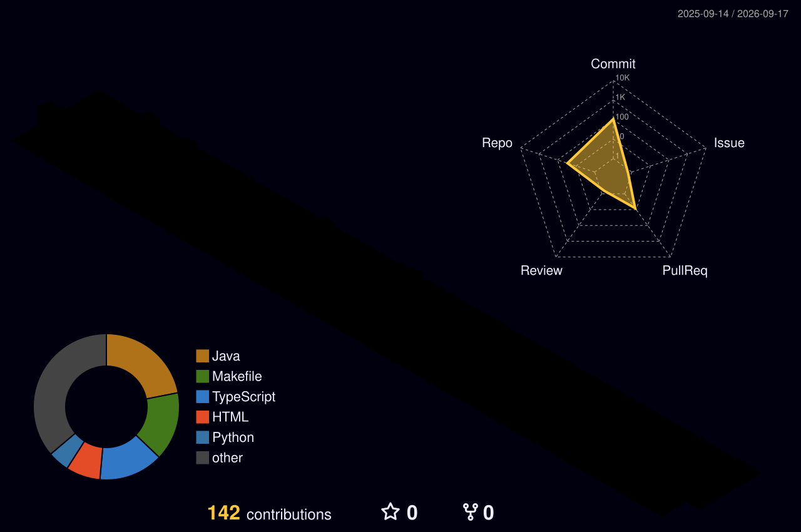

  <!-- 1. 打字特效 (Typing SVG) -->
  

  <!-- 访客统计与关注者徽章 -->
  

    
    
  

---

### 🚀 About Me

- 🔭 **Focus**: AI / LLM Inference Optimization, High-Performance Systems, and Distributed Infrastructure.
- 💻 **Core Languages**: Proficient in **C++**, **Rust**, **Python**, and **Java**.
- 🛠️ **Systems & Hardware**: Exploring accelerator runtime optimization, coroutine scheduling, and custom memory management.
- 🌱 **Current Exploration**: State-of-the-art LLM serving architectures, kernel acceleration, and low-level system design.
- ⚡ **Philosophy**: Writing clean, robust, and scalable software from low-level systems to modern backends.

---

### 🏆 GitHub Trophies

<!-- 2. GitHub 资料奖杯 (GitHub Profile Trophy) -->

  

---

### 🛠️ Tech Stack & Tooling

#### Languages & Core

  
  
  
  
  
  

#### AI, Frameworks & Systems

  
  
  
  
  

#### DevOps & Environment

  
  
  
  
  

---

### 📊 GitHub Activity & Statistics

  <!-- 3. GitHub 统计卡片 (GitHub Readme Stats) & 4. 连续打卡 (Streak Stats) -->
  
  
    
  <!-- 5. 使用语言统计 (Top Languages) -->
  
    
  <!-- 6. 修仙系列统计卡片 (Immortality Stats) -->
  

---

### 📈 Activity Graph

<!-- 7. GitHub 31天活动统计图 (Activity Graph) -->

  

---

### 🌐 3D Contribution Graph

<!-- 3D 贡献图 (彩虹夜景风格) -->

  

---

### 🐍 Contribution Snake

<!-- 贪吃蛇动画 -->

  <picture>
    <source media="(prefers-color-scheme: dark)" srcset="https://raw.githubusercontent.com/darkerkiller/darkerkiller/output/github-contribution-grid-snake-dark.svg">
    <source media="(prefers-color-scheme: light)" srcset="https://raw.githubusercontent.com/darkerkiller/darkerkiller/output/github-contribution-grid-snake.svg">
    
  </picture>

