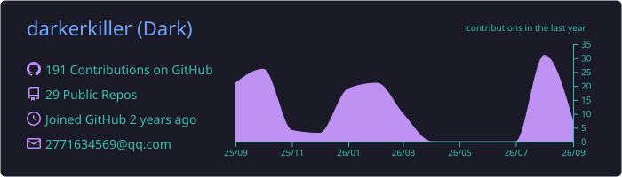
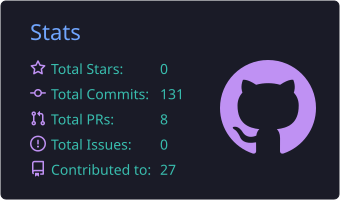
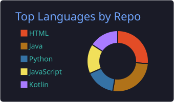
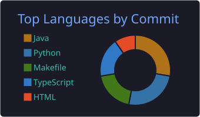

  # 💫 Hi there 👋
  
  ### 🚀 Software Engineer & Systems Enthusiast | LLM Infra & Performance Optimization

  

    
    
    
  

---

### 🚀 About Me

- 🔭 **Focus**: AI / LLM Inference Optimization, High-Performance Systems, and Distributed Infrastructure.
- 💻 **Core Languages**: Proficient in **C++**, **Rust**, **Python**, and **Java**.
- 🛠️ **Systems & Hardware**: Exploring accelerator runtime optimization, coroutine scheduling, and custom memory management.
- 🌱 **Current Exploration**: State-of-the-art LLM serving architectures, kernel acceleration, and low-level system design.
- ⚡ **Philosophy**: Writing clean, robust, and scalable software from low-level systems to modern backends.

---

### 🎖️ Developer Highlights & Milestones

  
  
  
  

---

### 🛠️ Tech Stack & Tooling

#### Languages & Core

  
  
  
  
  
  

#### AI, Frameworks & Systems

  
  
  
  
  

#### DevOps & Environment

  
  
  
  
  

---

### 📊 GitHub Profile Summary & Statistics

<!-- 替代 GitHub Stats 与 Top Langs 的本地高可靠卡片组 -->

  
  
    
  
  
    
  <!-- 修仙境界卡片 -->
  

---

### 🌐 3D Contribution Graph

<!-- 彩虹夜景 3D 贡献立体图 -->

  

---

### 🐍 Contribution Snake

<!-- 贪吃蛇贡献动画 -->

  <picture>
    <source media="(prefers-color-scheme: dark)" srcset="https://raw.githubusercontent.com/darkerkiller/darkerkiller/output/github-contribution-grid-snake-dark.svg">
    <source media="(prefers-color-scheme: light)" srcset="https://raw.githubusercontent.com/darkerkiller/darkerkiller/output/github-contribution-grid-snake.svg">
    
  </picture>

